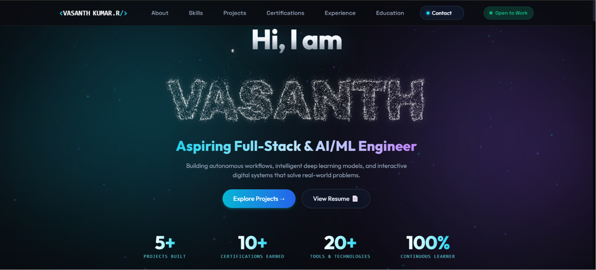

# Vasanth Kumar R — AI & Full-Stack Engineer

> **Live Portfolio:** [https://vasanth-kumar-portfolio-sooty.vercel.app/?hl=en-IN](https://vasanth-kumar-portfolio-sooty.vercel.app/?hl=en-IN)

## 🌌 Overview
A high-performance, immersive engineering portfolio designed to break away from traditional static templates. This site serves as a live demonstration of modern frontend architecture, pairing deep technical systems with fluid, hardware-accelerated interactive elements.

My engineering focus bridges the gap between intelligent backend models (PyTorch, FastAPI), autonomous workflow automation (n8n), and production-ready web interfaces.

## ✨ Creative & Technical UI Features
- **Hardware-Accelerated 3D Interactions:** Integrates a custom Spline 3D rendering pipeline optimized for zero-jitter, 60fps performance across desktop and mobile.
- **Custom Particle Physics Engine:** Features a bespoke, interactive canvas-based particle text system that instantly resolves on load and reacts to touch/cursor physics.
- **Cascading 3D Typography:** A rapid, fluid roll animation engineered for the primary navigation brand logo on rapid cursor pass-through.
- **Organic Aesthetic Touches:** Custom CSS geometry rendering authentic, hand-drawn asymmetrical highlighter strokes.
- **Strict Zero-Shift Responsiveness:** Meticulously balanced for mobile viewports, prioritizing smooth native scrolling and zero horizontal overflow.

## 🚀 Featured Engineering Projects
- **Sentinel AI:** Multimodal real-time emotion recognition system built with PyTorch, MediaPipe, WebSockets, and FastAPI.
- **Eco-Agent:** Autonomous AI agent developed during the Kaggle & Google AI Agents Intensive.
- **Smart Weather Alerting System:** Automated n8n workflow monitoring live meteorological triggers to deliver structured real-time alert dispatches.
- **Tech News Automation:** Autonomous n8n pipeline aggregating tech intelligence and RSS feeds via Google Gemini models.
- **Omni-Trace:** Robust web-based sustainability and carbon footprint tracker built with JavaScript and Chart.js.

## 📫 Connect
- **LinkedIn:** [linkedin.com/in/vasanth-kumar-r-global](https://linkedin.com/in/vasanth-kumar-r-global)
- **GitHub:** [github.com/rvasanthkumar73-dev](https://github.com/rvasanthkumar73-dev)
- **Email:** r.vasanthkumar73@gmail.com
